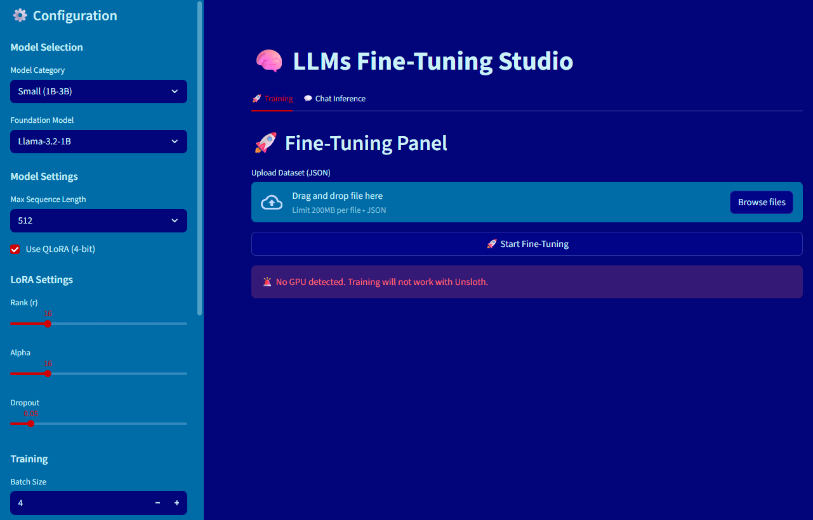

# LLMs_Fine_Tuning_Studio
**LLMs_Fine_Tuning_Studio:** A production-ready Streamlit platform for fine-tuning open-source LLMs using LoRA and QLoRA across Hugging Face and Unsloth backends, supporting multiple foundation models, dataset ingestion, evaluation, experiment tracking, and model deployment.

## 🧩 Current Features

✅️ Fine-tuning LLMs using LoRA and QLoRA with Unsloth and Hugging Face libraries  
✅️ Dataset management using external JSON files  
✅️ Modular training and inference pipelines  
✅️ Configuration-driven architecture  
✅️ Support for Hugging Face foundation models  
✅️ Google Colab GPU training workflow  
✅️ Clean and scalable project structure  

 

## ❯❯❯ Roadmap

☑️ Streamlit-based training dashboard  
☑️ Dataset upload and management interface  
☑️ Hyperparameter configuration (epochs, batch size, learning rate, etc.)  
☑️ Real-time training logs and metrics visualization  
☑️ LoRA and QLoRA support  
☑️ Multiple model selection  
☑️ Hugging Face Hub integration  
☑️ Model evaluation and benchmarking  
☑️ Experiment tracking and versioning  

## 🛠️ Tech Stack

✔️ Python  
✔️ Unsloth  
✔️ Hugging Face Transformers  
✔️ TRL (Transformer Reinforcement Learning)  
✔️ PEFT (LoRA / QLoRA)  
✔️ PyTorch  
✔️ Streamlit  
✔️ Google Colab  

## 🚧 Project Status

### Active Development
The project currently supports end-to-end fine-tuning and inference workflows and is being extended into a full-featured Streamlit application for no-code LLMs fine-tuning and experimentation.

## ▶️ Run

```
pip install -r requirements.txt

streamlit run app.py
```
---

## 🧑🏻‍💻 Author
### Hadi Hosseini    
AI/ML Engineer | Data Engineer | Biomedical Data Scientist  
➡️ www.linkedin.com/in/hadi468

